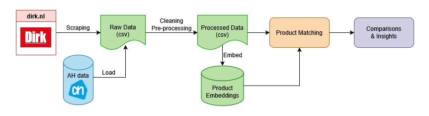
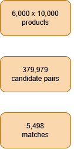
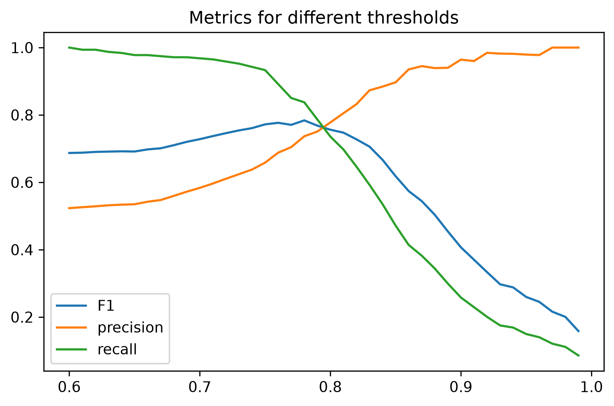
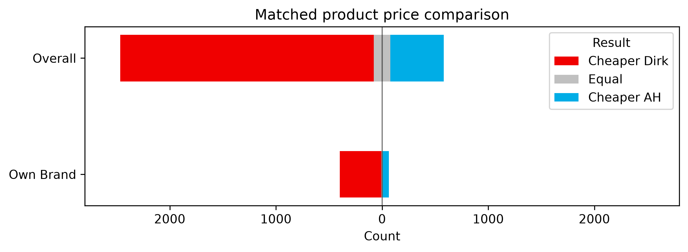

# Supermarket Product Matching for Price Comparison

# Overview

The project was inspired by a simple question: can data objectively determine which supermarket offers better prices?
Comparing prices across supermarkets is challenging since identical products often have differnt representations.

This project builds an entity matching pipeline that identifies these identical products across two Dutch supermarkets using embeddings and blocking techniques for entity resolution, enabling price comparisons.

The pipeline achieved reliable product matching performance and was used to compare prices between supermarkets.

This project was developed as part of my portfolio to explore and build various data science skills. It is intended for educational purposes only and is not affiliated with, endorsed by, or sponsored by any of the supermarkets mentioned.



# Dataset

The data has been sourced from two large Dutch supermarket chains: **Dirk** and **Albert Heijn (AH)**.

The Dirk dataset was collected using a custom web scraper (`scraper/dirk.py`), which iterates through all non-food products and extracts:

- product name
- quantity
- price
- nutritional info
- ingredients

The AH data was obtained from the publicly available dataset published on [Zenodo](https://zenodo.org/records/19220002). This dataset also contains the same product attributes.

I initially attempted to scrape the AH website as well, but due to anti-bot measures I opted to use a publicly available dataset instead.

The datasets used in this project are not included in the repository due to third-party data ownership and usage restrictions. The repository contains the code, pipeline, and sample files needed to understand and reproduce the workflow.

# Workflow

This project consist of 5 main stages:

<!-- # Some picture about workflow here -->

1. **Data Collection**
   - Scrape product data from Dirk with a custom web scraper (`scraper/dirk.py`)
   - Load the AH dataset

2. **Data Cleaning** (`src/supermarket/processing.py`)
   - Standardize product names and units
   - Parse and store nutritional information

3. **Feature Engineering** (`src/supermarket/feature_engineering.py`)
   - Create blocking keys for matching
   - Create additional features for exploratory analysis such as protein and price comparisons

4. **Product Matching** (`src/supermarket/matching.py`)
   - Create semantic embeddings for the products
   - Apply blocking to create candidate product pairs
   - Calculate similarity scores using embedding similarity and rule-based features
   - Apply matching rules to identify equivalent products across supermarkets

5. **Final price comparisons** (`src/supermarket/comparison.py`)
   - Compare prices of matched products across supermarkets
   - Identify patterns in relative affordability between supermarkets (Overall vs Own-brand)

## EDA

Additional exploratory analyses (`notebooks/analysis.ipynb`) were performed to investigate:

- Analyze product distributions and price differences.
- Explore the affordability of vegan, vegetarian, and meat-based protein sources.

# Methodology

## Scraping

Product data was collected from Dirk's supermarket websites using a custom scraper built with Playwright. The scraper uses browser automation to extract dynamically loaded product information and stores the raw data for further processing.
The scraper extracts the following product attributes:

- product name
- quantity
- price
- nutritional information
- ingredients

Since supermarket websites often change their structure, the scraper was designed to separate data extraction from downstream processing. This allows the matching and analysis pipeline to operate on a stable and consistent dataset independent of the source.

## Feature Engineering

- **Own brand**: Determines if a product is a _huismerk_ (own brand). Own brand products are usually cheaper than branded products, so comparing Dirk's to AH's own brand products allows fair comparisons. A product is classified as a own brand if it contains one of the supermarket's own-brand names. These were sourced from:
  - https://www.dirk.nl/meer/inspiratie/a-merk-vs-huismerk
  - https://www.ah.nl/informatie/eigen-merken
- **Vegan/Veggie label**: To compare different meat vs non-meat products on price, nutrition and affordability, each product is assigned a boolean value for the `vegan` and `vegetarian` labels. The label is inferred from the product's ingredients using a rule-based approach. While this method works well for most products, it is not perfect and may occasionally misclassify items.
- **Value metrics**: Additional features such as protein per euro and kcal contribution per macronutrient are derived by combining nutritional information with product prices to compare nutritional value relative to cost.

<!-- Matching -->

## Block Key Generation

Comparing every product from one supermarket with every product from the other would require (6.000 x 10.000 = 60 million) product comparisions. To reduce this search space, I generated multiple blocking keys based on several features.

Block keys were generated as a combination of:

- Whether the product is a _huismerk_ (own-brand product).
- Rare tokens from product names, selected based on token IDF-score. After removing stopwords and quantity/size information, the rarest tokens were used to generate blocking keys.

Including product units in the blocking keys was considered. It would be logical to not compare liquids with solid foods. But after review, some products (e.g. milshakes) would have the unit `kg` in one supermarket and `l` in the other. Therefore, product units were not used for blocking.

Products sharing at least one block key became candidate pairs for the matching stage. This reduced the number of comparisons while maintaining high candidate recall.

## Product Embeddings

Product Embeddings were created using the pretrained Sentence-BERT model. I used a multi-language model, `intfloat/multilingual-e5-base`, which supports Dutch. This model produces vectors with an embedding size of 768.
The sentence that is being embedded contains the product name, price, quantity, unit, and ingredients. These embeddings are later used in the matching function and aims to capture the semantic meaning of a product.

## Scoring Function

During candidate genration each Dirk product is matched with one or more AH products. Next each candidate pair is assigned a similarity score between 0 and 1 using a matching function.

The final similarity score of a pair is determined by five sub-similairties:

- Cosine simmilarity of the embeddings
- Fuzzy similarity of the product names
- Jaccard similarity of the product name tokens
- Quantity similarity between the products
- Price similarity between the product

These are then combined into a weighted sum for the final score:

$$
\text{score}(i,j) =
0.35 \cdot \text{cosine}(i,j) +
0.25 \cdot \text{fuzz}(i,j) +
0.10 \cdot \text{jaccard}(i,j) +
0.25 \cdot \text{quantity}(i,j) +
0.05 \cdot \text{price}(i,j)
$$

Explanation of the weights:

- **Cosine similarity (0.35):** Captures semantic similarity between products using embeddings
- **Fuzz score (0.25):** Handles minor naming differences
- **Jaccard score (0.10):** Strictly measures token overlap between names
- **Quantity score (0.25):** Ensures matching items have compatible quantities
- **Price score (0.05):** Provides a small adjustment based on price similarity

A combination of Fuzz and Jaccard scores have been used to better capture product name similarity.

Jaccard similarity alone is sensitive to exact token overlap and can fail on minor spelling or formatting differences (e.g. "Müllermilk shake" vs "Müller milkshake").

Fuzzy matching alone can overemphasise shared words in longer product names, where common but less informative tokens can unintenionally inflate similarity (e.g. "kip compleet" vs "pannenkoeken mix compleet").

## Definition of a Match:

**Does** count as a match:

- Same product but different brand (if same brand is not available in other the chain)
  - (e.g Silvo Mix gehakt Italiaans - Verstegen Kruidenmix voor gehakt Italiaans)
- Same product but different quantity
  - (e.g Fanta Original 330ml - Fanta 250ml)

Does **not** count as a match:

- Organic (_biologisch_) vs non-organic
  - (e.g Volle melk - Biologische Volle melk)
- Different variants
  - (e.g Pepsi Zero - Pepsi Original)
  - (e.g Coca Cola Vanille - Coca Cola Cherry)
- Same product but different brand (if same brand **is** available in other the chain)
  - (e.g Coca Cola Regular - Pepsi Cola Regular)

<!-- End Matching -->

# Results

## Matching

Reduced number of candidates from ~64 million → 379,979 using blocking techniques (99.4% reduction).

Out of these candidates, a total of 5,498 Dirk products have been matched to an AH product with a matching-score > 0.6.

Since no ground truth was available, a stratified random sample of 600 of the 5,498 candidate pairs was manually labelled according to the criteria described in the [Definition of a Match](#definition-of-a-match).
To ensure representation across the full range of matching scores, 25% of the sample was drawn from the highest-scoring third of candidates, 50% from the middle third, and 25% from the lowest-scoring third.

<div align="center">
  
</div>

## Evaluation

The matching model outputs a continuous similarity score rather than a binary prediction. Therefore, ROC-AUC and PR-AUC are used to evaluate how well the similarity scores separate true product matches from non-matches.

Following are the results on the stratified random sample described earlier:

- **ROC-AUC:** 0.8396
- **PR-AUC:** 0.8621

<br>

To convert similarity scores into binary match predictions, a classification threshold was optimized by maximizing the F1-score.

<div align="center">
  
</div>

The figure shows how precision, recall, and F1-score change with the decision threshold value. A threshold of **0.78** provides the highest F1-score and was therefore selected.

At this threshold:

- **F1-score:** 0.7839
- **Precision:** 0.7367
- **Recall:** 0.8376

## Discussion

The model achieves a ROC-AUC of 0.8396, indicating that the similarity scores are effective at ranking product matches above non-matches.

Using the optimized threshold of 0.78, the model achieves an F1-score of 0.7839. The recall of 0.8376 shows that the model successfully identifies most true product matches, while the precision of 0.7367 indicates that some false matches remain.

For price comparison purposes, the current model is a useful starting point, but additional improvements could focus on reducing false positives through more advanced matching models.

## Price Comparison

To compare supermarket prices, the matched product pairs were filtered to remove likely promotional prices. Pairs with a relative price difference greater than 40% were excluded as outliers.

The relative price difference was calculated as:

$$
\frac{\text{price}_{AH} - \text{price}_{Dirk}}{\max(\text{price}_{AH}, \  \text{price}_{Dirk})}
$$

**Labelled Correct pairs:**

After filtering, the average relative price difference across the labelled matched products was **-0.064**, indicating that **Dirk is 6.4% cheaper on average**.

After excluding likely promotional outliers, 61 matched own-brand products remained for price comparison. Here was found that **Dirk is 11.3% cheaper on average**. This finding is consistent with [Kassa's 2025 supermarket price comparison](https://www.bnnvara.nl/kassa/artikelen/kassas-boodschappenmandje-2025-aldi-voordeligste-ah-duurste-supermarkt), which also found which found a similar difference of 13.9%. The small difference can be explained by the use of different product baskets and selection criteria.

**Predicted Matches:**

Using the model's predicted matches (similarity > [0.78](#evaluation)) yields similar results: **Dirk is 6.1% cheaper on average and 10.0% cheaper when only considering own brand products**.

The difference between these results and those obtained from the manually verified matches is expected. The predicted matches include a much larger sample but may contain false positives and false negatives, whereas the manually verified pairs is based on a smaller sample without errors.

### Matched product price comparison by supermarket:

After matching, prices were compared between supermarkets.

| Category  | Cheaper Dirk | Equal | Cheaper AH |
| --------- | -----------: | ----: | ---------: |
| Overall   |        2,387 |   158 |        501 |
| Own Brand |          393 |    13 |         57 |

<br>



# Code Structure

Below an overview of structure for the most important files

```

supermarket-product-matcher/
├── data/
│ ├── processed/
│ ├── raw/
│ └── results/
├── scraper/
│ └── dirk.py
├── src/
│ └── supermarkt/
│     ├── processing.py
│     ├── feature_engineering.py
│     ├── matching.py
│     ├── evaluation.py
│     └── comparison.py
└── notebooks/
  └── analysis.ipynb

```

# Limitations

- **Product availability differences**:
  The supermarkets may not offer identical assortments. Products available in one supermarket but not the other cannot be compared.
- **Different data collection periods:**
  The AH dataset was from March 2026, while the Dirk data was scraped in July 2026. Price differences may therefore partly reflect changes over time rather than current differences between supermarkets.
- **Price fluctuations:**
  Product prices can include temporary discounts or promotions, which can negatively affect the comparisons.
- **Product matching errors:**
  Although the matching pipeline was evaluated using manually labeled pairs, some incorrect matches or missed matches may remain. These errors can influence downstream price comparisons.
- **Missing Product Information:**
  Missing or inconsistent product data, such as nutrients or ingredients, may reduce the accuracy of product representations and negatively affect similarity scores between product pairs.

# Future work

- Add more supermarkets chains to increase coverage
- Improve product matching accuracy by using more sophisticated models
- Track product prices over time to identify and distiguinsh discounts from actual price differences.

# Running the project

Clone the repository:

```bash
git clone https://github.com/Mike27122003/supermarket-product-matcher
```

Install [uv](https://docs.astral.sh/uv/) if you don't already have it installed.

Install dependencies:

```bash
uv sync
.venv\Scripts\activate
```

Run any of the files in `src/supermarket`, `scraper/dirk.py` using:

You can run individual scripts using:

```bash
uv run <path-to-script>
```

Examples:

```bash
uv run scraper/dirk.py
uv run src/supermarkt/processing.py
uv run src/supermarkt/matching.py
```

Alternatively, you can run the Jupyter notebook in `notebooks/analysis.ipynb`.
